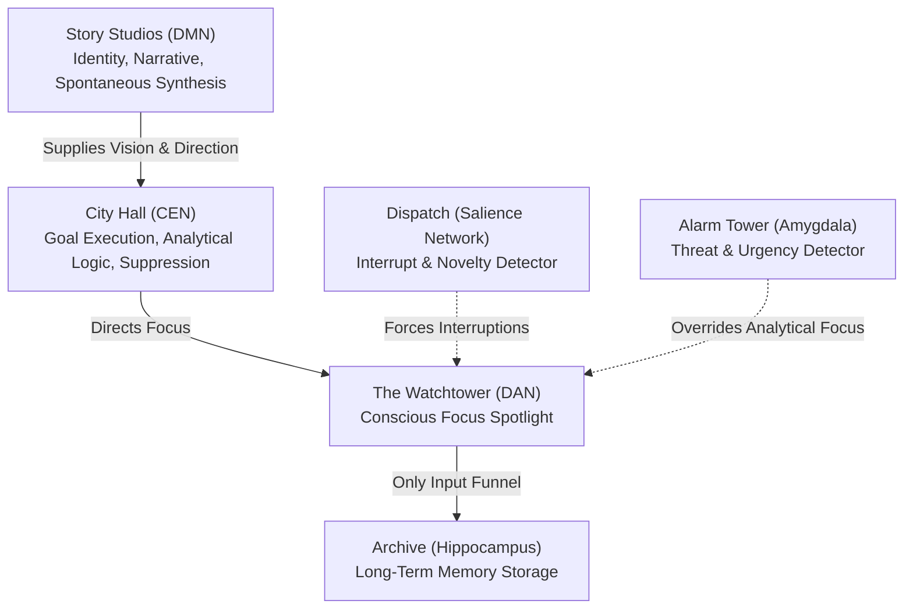

# Cognitive Neuroscience Master Guide

> [!abstract] Core Principle
> Human performance is governed by strict biological laws. By aligning your daily routines with neural biology, you can build elite capabilities in software engineering, mathematics, astronomy, physical vitality (hair and body health), and global career mobility.

---

## Table of Contents

- [[#1. Neural Architecture: The Brain as a City|1. Neural Architecture: The Brain as a City]]
- [[#2. Identity Neuroplasticity: The 4-Part Script|2. Identity Neuroplasticity: The 4-Part Script]]
- [[#3. Digital Hygiene and Working Memory|3. Digital Hygiene and Working Memory]]
- [[#4. Monotasking and Context-Switching Costs|4. Monotasking and Context-Switching Costs]]
- [[#5. The Incubation Protocol for Complex Logic|5. The Incubation Protocol for Complex Logic]]
- [[#6. Information Diet and Neurochemistry|6. Information Diet and Neurochemistry]]
- [[#7. Chronobiology and Energy Windows|7. Chronobiology and Energy Windows]]
- [[#8. Stress Cycles, Hair Vitality, and Physical Stamina|8. Stress Cycles, Hair Vitality, and Physical Stamina]]
- [[#9. The 9-Week Neural Reset Protocol|9. The 9-Week Neural Reset Protocol]]
- [[#10. Daily Operating System|10. Daily Operating System]]

---
## 1. Neural Architecture: The Brain as a City



### Core Neural Systems

- **Default Mode Network (DMN):** The brain's narrative and imagination engine. It generates self-identity, connects distant concepts, and drives creative breakthroughs during low-arousal states (walking, resting, showers).
- **Central Executive Network (CEN):** The execution engine. It handles logical deduction, writing code, mathematical proofs, and active distraction suppression.
- **The Seesaw Rule:** When CEN is active, DMN is inactive. You cannot force spontaneous architectural breakthroughs while grinding under high cognitive load.
- **Dorsal Attention Network (DAN):** The spotlight of conscious awareness.
- **Salience Network (SN):** The interrupt detector. Notifications and flashing tabs trigger this network to forcibly divert your DAN away from deep work.
- **Hippocampus:** Long-term memory storage. **Attention is the only gateway into the Hippocampus.** Without undivided focus, technical syntax and mathematical concepts are never encoded.

---
## 2. Identity Neuroplasticity: The 4-Part Script

Your brain physically rewires itself according to your internal narrative and daily actions.


- **Victim Pattern:** Views advanced math, elite development, and international relocation as unattainable barriers.
- **High-Agency Pattern:** Views all obstacles as engineering problems to be solved with systematic protocols.

### Daily Hand-Written Scripting Template

> [!example] 4-Part Daily Script (Write by hand in a notebook)
> 1. **Identity Statement:** "I am a world-class software engineer, an insightful mathematician and astronomer, and a person of exceptional physical health, vitality, and global mobility."
> 2. **Scientific Grounding:** "I know that deliberate practice, neuroplasticity, and biological energy management systematically build technical skill and physical resilience."
> 3. **Future ROI:** "By mastering advanced logic, keeping systemic inflammation low to protect my body and hair, and maintaining deep focus, I secure high-leverage global roles and relocate abroad."
> 4. **Implementation Intention:** "When my morning deep-work block starts, I place my phone in another room, open my code editor, and complete 90 minutes of single-task engineering."

---
## 3. Digital Hygiene and Working Memory

### The Phone-Visible Effect (UT Austin Study)

| Condition | Cognitive Result |
| :--- | :--- |
| **Phone in another room** | Highest working memory and fluid IQ |
| **Phone in pocket/bag** | Moderate cognitive performance |
| **Phone face-down on desk (OFF)** | Significant drop in analytical capacity |

> [!warning] Working Memory Drain
> Even when powered off, a visible phone consumes metabolic glucose as your prefrontal cortex passively suppresses the urge to check it. This reduces the cognitive RAM needed to hold complex data structures, algorithms, and equations.

### Workspace Protocol

- **Phone Parking Lot:** Place your phone inside a drawer or separate room during work sessions.
- **Notification Elimination:** Disable all desktop banners, sound alerts, and unread badges.
- **Single-Screen Environment:** Keep only the active IDE, terminal, and reference docs open. Close all communication tabs.
- **30-Minute Curfew:** No screens for 30 minutes after waking and 30 minutes before sleep.

---
## 4. Monotasking and Context-Switching Costs

The human brain is a **monotasking processor**. Multitasking is rapid, costly context switching.

```mermaid
gantt
    title Monotasking vs. Fragmented Context Switching
    dateFormat X
    axisFormat %s

    section Monotask
    Deep Engineering Architecture (90 min uninterrupted): active, m1, 0, 90

    section Fragmented Work
    Code Logic (15 min)             :crit, f1, 0, 15
    Context Switch (5 min)          :f2, 15, 20
    Check Messages (10 min)         :crit, f3, 20, 30
    Rebuild Mental Cache (15 min)   :f4, 30, 45
    Code Logic (15 min)             :crit, f5, 45, 60
    Useful Work Lost (>50%)         :crit, f6, 60, 90
```



> [!important] Mental Model Reconstruction
> Complex software architecture and mathematical proofs require holding multi-variable state in working memory. A single interruption flushes this cache, requiring **15 to 23 minutes** of uninterrupted focus to rebuild.

---
## 5. The Incubation Protocol for Complex Logic

Breakthrough insights in algorithm design, astrophysics, and difficult bugs occur during **incubation**.


1. **Intensive Loading (45–60 min):** Analyze the problem thoroughly using active focus (CEN). If blocked, stop pushing against fatigue.
2. **Intentional Disengagement:** Step away from all screens. Take a walk, take a shower, or do a light physical chore. Do not consume media during this break.
3. **Capture Insight:** Keep a physical notebook nearby to capture the solution when the DMN surfaces it.

---
## 6. Information Diet and Neurochemistry

| Dimension | Short-Form Media (Reels/Shorts) | Long-Form Study (Papers/Proofs/Books) |
| :--- | :--- | :--- |
| **Cognitive Impact** | High-velocity brain candy | High-density cognitive fuel |
| **Attention Span** | Induces fragmentation and restlessness | Builds sustained concentration capacity |
| **Memory Encoding** | Near-zero retention | Deep synaptic consolidation |
| **Neurochemistry** | Dopamine spikes followed by depletion | Steady dopamine and acetylcholine |
| **Emotional State** | Increases anxiety and perceived loneliness | Enhances empathy and autobiographical clarity |

> [!note] Neurochemistry of Connection
> Dopamine drives the craving for connection. Consuming short-form videos of strangers fails to trigger oxytocin (bonding) or serotonin (contentment), leaving you hungrier and more isolated. Real-world interactions satisfy the biological circuit.

- **Bloom Scrolling:** Curate feeds exclusively for software engineering, mathematics, astronomy, and physical fitness.
- **Single-Screen Standard:** Watch lectures or courses on one screen with no secondary devices present.

---
## 7. Chronobiology and Energy Windows

Human circadian rhythms are genetically determined (2017 Nobel Prize). Forcing a 5:00 AM wake-up against your natural genetics impairs analytical ability and physical recovery.

### The Three Chronotypes

1. **AM Shifted (~25% of population):** Early risers. Energy peaks between 7:00 AM – 11:30 AM and declines linearly.
2. **Biphasic (~65% of population — majority):** Ramps up within 45–60 minutes. First peak at 9:30 AM – 1:00 PM; afternoon slump from 2:00 PM – 4:30 PM; second focus peak from 5:30 PM – 8:00 PM.
3. **PM Shifted (~10% of population):** Night owls. Morning is creative and low-inhibition; deep analytical focus peaks between 6:00 PM – 11:00 PM.

### Daily Energy Zones

- **Peak Zone (2–3 Hours):** Complex engineering problems, novel mathematics, core architecture. Zero distractions allowed.
- **Dip Zone (1.5–2 Hours):** Resistance training, cardio, meal preparation, administrative tasks, routine code reviews.
- **Recovery/Think Zone (1–2 Hours):** Astronomy reading, high-level planning, nature walks, sleep preparation.

---
## 8. Stress Cycles, Hair Vitality, and Physical Stamina

Stress hormones (cortisol, epinephrine) enhance focus in the short term. Burnout and physical degradation occur when stress cycles are never resolved.

```
Chronic Unresolved Cortisol Spikes
       │
       ├─► Systemic Inflammation ────► Impaired Muscle Recovery & Fitness
       │
       └─► Microvascular Restriction ─► Follicle Starvation & Hair Loss
```

> [!important] Physiological Protection Rules
> - **Complete the Stress Cycle:** Use physical training (lifting, sprinting, heavy walking) daily to metabolize circulating cortisol.
> - **7+ Contiguous Hours of Sleep:** Slow-wave sleep releases Growth Hormone (HGH), repairs tissue, preserves hair roots, and consolidates mathematical memory.
> - **Clean Nutrition:** Ensure adequate protein, essential fatty acids, zinc, iron, vitamin D, and hydration to sustain brain metabolism and follicle strength.

### The 3M Break Framework

- **Micro Breaks (10–15 min daily):** Breathwork, natural sunlight, physical mobility, eye rest.
- **Meso Breaks (2–4 hours weekly):** Active non-screen hobbies (sports, learning an instrument, cooking complex meals).
- **Macro Breaks (Half to full day monthly):** Complete digital disconnection and environmental reset.

---
## 9. The 9-Week Neural Reset Protocol

| Phase | Weeks | Target Protocols |
| :--- | :--- | :--- |
| **Phase 1** | **Weeks 1–2** | Baseline audit; establish Phone Parking Lot; enforce 30-min screen curfews. |
| **Phase 2** | **Weeks 3–4** | Eliminate short-form feeds; execute 90-min single-task coding/math blocks. |
| **Phase 3** | **Weeks 5–6** | Weekly 60-min paper-only Think Time; align deep work with chronotype. |
| **Phase 4** | **Weeks 7–8** | Optimize training and nutrition for hair/body health; solve advanced astronomy/math sets. |
| **Phase 5** | **Week 9** | Solidify permanent daily and weekly operating rhythms. |

---
## 10. Daily Operating System

- [ ] **Morning Launch (30–45 min):** No screens for first 30 min. Drink 500ml water. Get 10 min natural sunlight. Write 4-part identity script by hand.
- [ ] **Core Deep-Work Block 1 — Engineering (90–120 min):** During peak biological window. Phone parked in another room. Zero communication apps open.
- [ ] **Physical Training & Recovery (60–90 min):** Resistance or athletic training in the dip window. Nutrient-dense meal for hair and muscle recovery.
- [ ] **Core Deep-Work Block 2 — Mathematics & Astronomy (60–90 min):** Problem sets and physics derivations. Apply Incubation Protocol when blocked.
- [ ] **Global Career Execution (30–45 min):** Open-source contributions, international job applications, networking with overseas engineering teams.
- [ ] **Evening Shutdown (45 min):** Brush teeth early to close eating window. Phone stored outside bedroom. Secure 7–8 hours continuous sleep.

---
*Created as a minimalist, high-signal reference for technical mastery, physical health, and global achievement.*